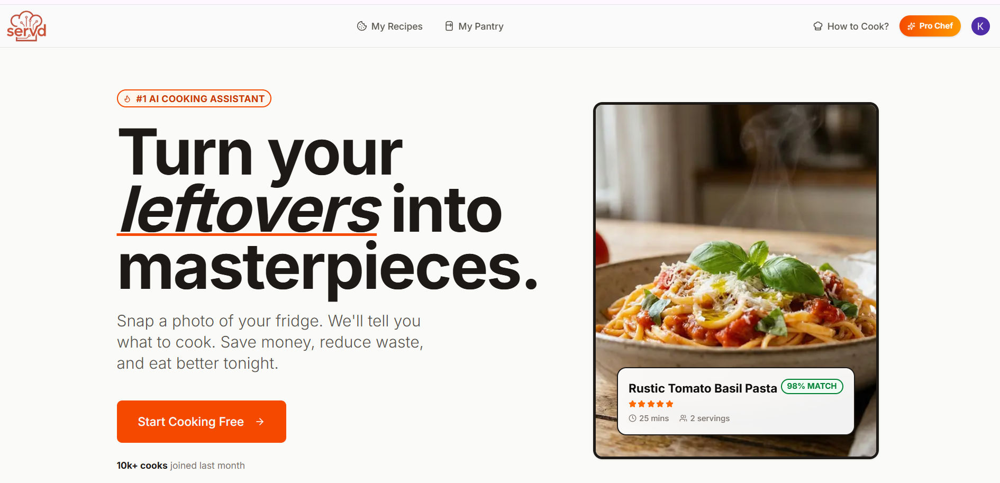

# Servd - An AI-Powered Recipe Platform (Frontend)

**Discover intelligent cooking with Servd — an AI-powered recipe platform featuring smart pantry scanning, subscription-based rate limiting, Arcjet bot protection, secure Clerk authentication, and advanced generative AI models for personalized recipes.**

---

<p align="center">
  
</p>

<div style="margin-top:10px" align="center">
  <!-- Keywords with logos -->
  
  
  
  
  
  
  
</div>


## 🔗 Related Repository

This project works together with the Servd Backend (Server Actions).

- 🖥 **Backend (Next.js  + Strapi Server Sctions with Neon DB ):**  
 [ https://github.com/KarthickRamAlagar/servd](https://github.com/KarthickRamAlagar/Servd_backend)


---

## 📋 Table of Contents

1. [Introduction](#-introduction)
2. [Technical Description](#-technical-description)
3. [Tech Stack](#-tech-stack)
4. [Features](#-features)
5. [Quick Start](#-quick-start)
6. [Installation](#-installation)
7. [Environment Variables](#-environment-variables)
8. [Development](#-development)
9. [Production Build](#-production-build)
10. [Deployment](#-deployment)
11. [License](#-license)
12. [Acknowledgements](#-acknowledgements)

---

### 🚀 Introduction

**Servd (Frontend)** is the client-side application of the Servd platform, built with React and Next.js.

This frontend interacts with the backend for:

- Subscription-based rate limiting
- Pantry scanning & recipe generation
- Arcjet bot protection
- Clerk authentication
- Generative AI-powered personalized recipes

> **Note:** To use all features, clone and run the backend repository separately.

---

### 🧠 Technical Description

Servd is engineered for intelligent cooking:

- **React 19 + Next.js 16** for a robust frontend.
- **Tailwind CSS 4** for utility-first styling.
- **Clerk** for secure authentication.
- **Arcjet** for bot protection.
- **Strapi** as headless CMS for recipe data.
- **Google Generative AI** for personalized recipe suggestions.

#### **Core Architecture**

- **Frontend**: React 19 + Next.js 16
- **Styling**: Tailwind CSS + Tailwind Merge
- **Animations**: tw-animate-css / Sonner
- **Auth & Security**: Clerk + Arcjet
- **Backend / CMS**: Strapi (Backend Repo)
- **AI Integration**: Google Generative AI
- **Deployment**: Vercel
---

### 🔧 Tech Stack (Summary)

<div align="center">
  
  
  
  
  
  
  
  
</div>

---

## ⚙ Features

- 🧠 **Personalized AI Recipe Suggestions**
- 📦 **Smart Pantry Scanning & Recipe Matching**
- 🔐 **Secure Authentication with Clerk**
- 🛡 **Arcjet Bot Protection**
- 💳 **Subscription-based Rate Limiting**
- 🎨 **Responsive UI with Tailwind CSS**
- ⚡ **Animations using tw-animate-css & Sonner**
- 🗂 **CMS Integration via Strapi** (Backend)

---

## ⚡ Quick Start

### 📦 Prerequisites

- Node.js ≥ 18
- npm / yarn / pnpm

---

## 🛠 Installation

### Clone Frontend & Backend Repos

```bash
# Clone Frontend
git clone https://github.com/KarthickRamAlagar/servd.git
cd servd
npm install

# Clone Backend (required for server actions & full functionality)
git clone https://github.com/KarthickRamAlagar/servd-backend.git
cd servd-backend
npm install

```

## 🔑 Environment Variables

<p>Create a .env file in  frontend  directory with the following variables:</p>

```bash
# Clerk Authentication
NEXT_PUBLIC_CLERK_PUBLISHABLE_KEY=<your api key goes here>
CLERK_SECRET_KEY=<your api key goes here>
NEXT_PUBLIC_CLERK_SIGN_IN_URL=<your sign-in path goes here>
NEXT_PUBLIC_CLERK_SIGN_UP_URL=<your sign-up path goes here>

# Arcjet Bot Protection
NEXT_PUBLIC_ARCJET_KEY=<your api key goes here>

# Strapi CMS
NEXT_PUBLIC_STRAPI_URL=<your strapi url goes here>
STRAPI_API_TOKEN=<your strapi api token goes here>

# Google Generative AI
GEMINI_API_KEY=<your api key goes here>

# Unsplash API
UNSPLASH_ACCESS_KEY=<your api key goes here>

```

## Development

- Frontend
  ```bash
  cd servd_FE
  npm run dev
  ```
 - Backend
    ```bash
   cd servd_BE
   npm run develop
  ```

## Open Frontend in Browser

```bash
http://localhost:3000

```

## Production Build

```bash
# Frontend
cd servd
npm run build
npm run start
```

## 🪪 License

MIT License

## 🙏 Acknowledgements

<p align="center">        </p>
